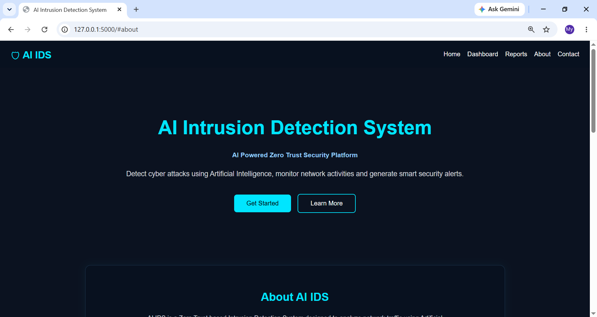
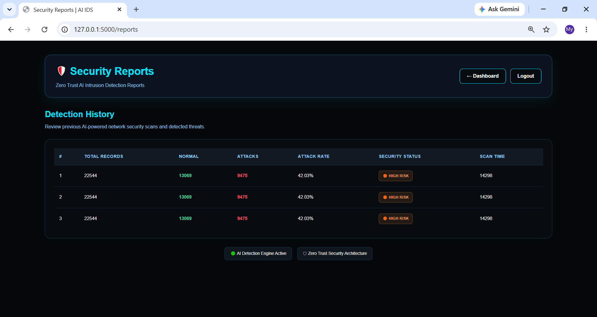
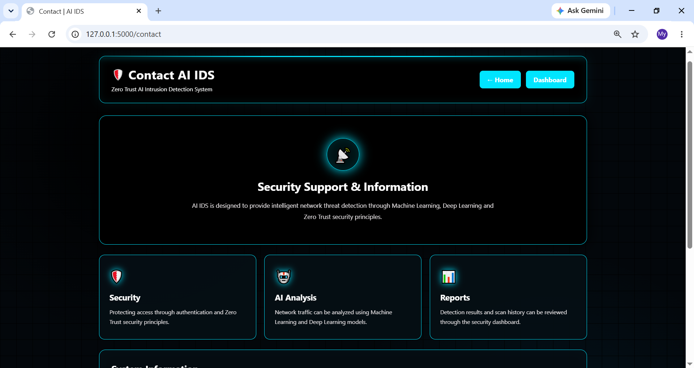
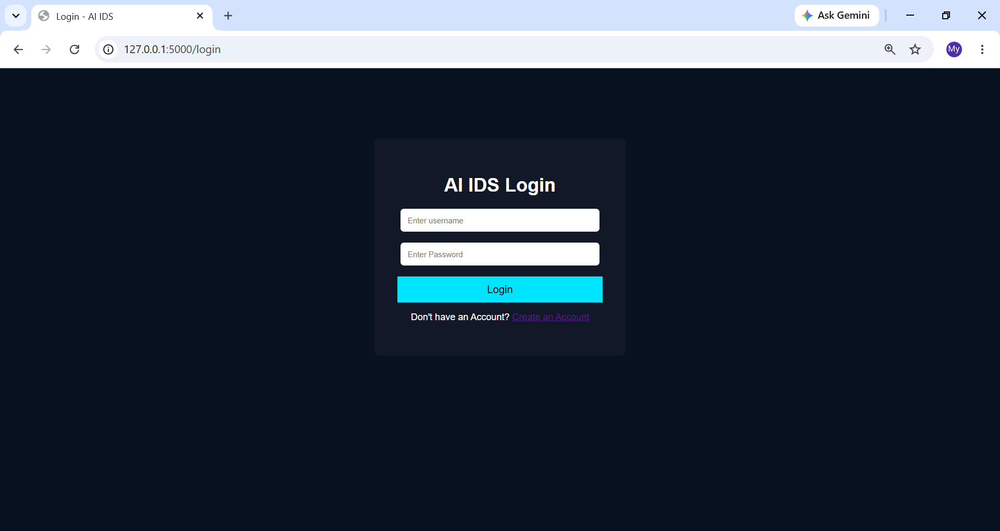
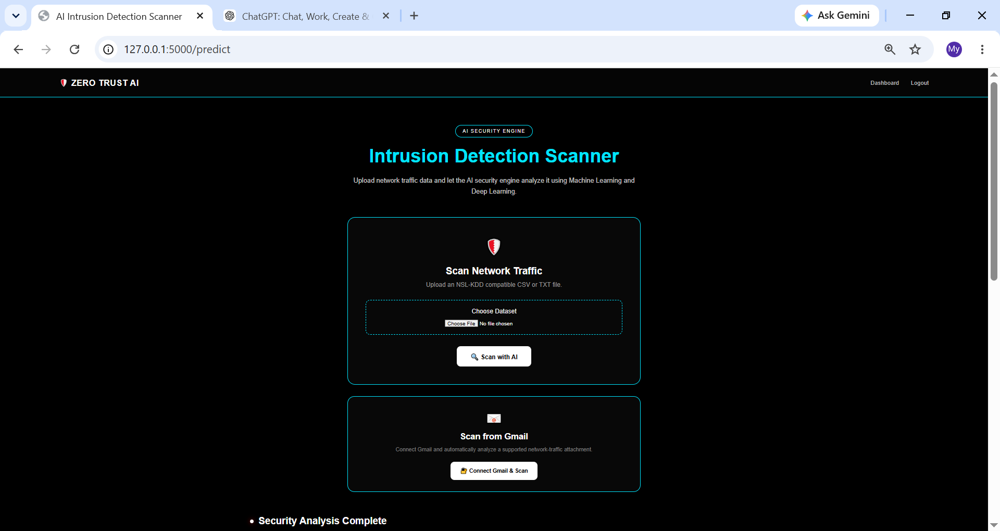
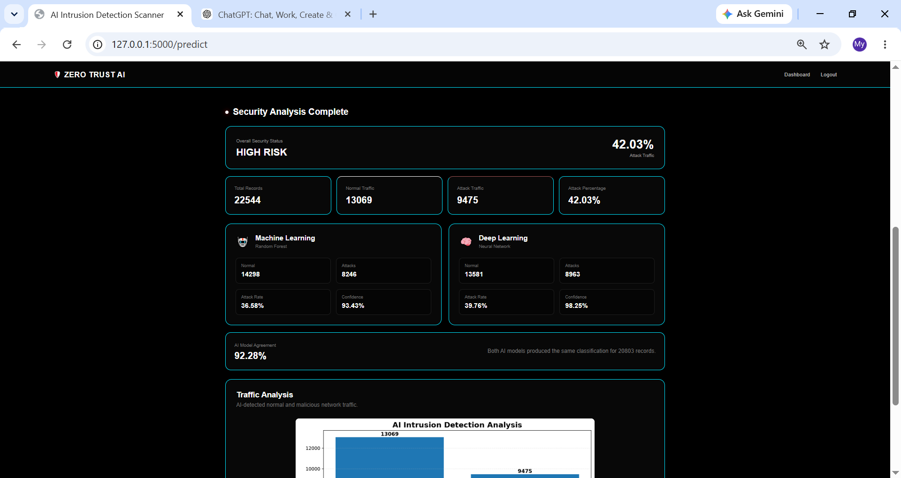

# 🛡️ Zero Trust AI Intrusion Detection System

### AI-Powered Network Intrusion Detection using Machine Learning, Deep Learning & Flask

[](https://www.python.org/)
[](https://flask.palletsprojects.com/)
[](https://scikit-learn.org/)
[](https://www.tensorflow.org/)
[](https://www.sqlite.org/)
[](https://developers.google.com/gmail/api)

---

## 📌 Project Overview

**Zero Trust AI Intrusion Detection System (AI IDS)** is a Python-based cybersecurity application that identifies potentially malicious network traffic using Artificial Intelligence and Machine Learning.

The system follows the **Zero Trust Security Model**, where incoming network traffic is treated as **untrusted until it has been analyzed and verified by the detection engine**.

The application provides a Flask-based web interface through which authenticated users can upload network traffic datasets, run AI-based intrusion detection, view security analytics, compare Machine Learning and Deep Learning results, and review previous scan history.

The system also includes **Gmail integration**, allowing supported CSV/TXT network-traffic attachments to be retrieved from an authenticated Gmail account and processed through the same AI detection pipeline.

---

## 📸 Screenshots

### 🏠 Home Page


### 📝 Register


### 🔑 Login


### 📊 Security Dashboard


### 🔍 Intrusion Detection Scanner


### 📈 Scan Results & Analysis


### 📄 Security Reports


### 📞 Contact


---

## 🎯 Problem Statement

Modern computer networks continuously face cybersecurity threats such as:

- Unauthorized access
- Denial-of-Service attacks
- Malicious network activity
- Suspicious traffic patterns
- Network intrusions

Traditional intrusion detection approaches often rely heavily on predefined rules or signatures, which can lose effectiveness as traffic patterns evolve or when suspicious activity doesn't match known signatures.

This project addresses that gap by applying **Machine Learning and Deep Learning techniques** to network traffic data. Instead of automatically trusting incoming data, the system follows a Zero Trust approach:

> **Never trust the input before analysis.**

Every supported network traffic file is validated and processed before the AI detection engine produces a security classification.

---

## 🎯 Project Objectives

| # | Objective | Description |
|---|-----------|--------------|
| 1 | **AI-Based Intrusion Detection** | Classify network traffic as Normal or Attack |
| 2 | **Secure Authentication** | User registration, login, password hashing, session-based auth, protected routes |
| 3 | **Flask Web Application** | Upload files, run analysis, view results/dashboards/reports |
| 4 | **Security Monitoring** | Store scan results in SQLite for review and monitoring |

---

## ⭐ Key Features

### 🔐 Secure User Authentication
- User registration and login
- Password hashing (no plain-text storage)
- Session-based authentication
- Protected dashboard routes
- Logout functionality

### 🤖 AI Intrusion Detection
The detection engine classifies network traffic and reports:
- Normal traffic / Attack traffic counts
- Attack percentage
- Overall security status
- Model confidence
- Model agreement

### 🌲 Machine Learning — Random Forest
A **Random Forest Classifier** performs binary intrusion detection:

```
0 → Normal
1 → Attack
```

The training pipeline includes network-data preprocessing and categorical feature encoding prior to model training.

### 🧠 Deep Learning
A neural network model provides an additional, independent security prediction that can be compared against the Machine Learning result.

---

## 🔄 AI Detection Pipeline

```
Network Traffic File
        │
        ▼
File Validation
        │
        ▼
Data Preprocessing
        │
        ▼
Feature Transformation
        │
        ├───────────────┐
        ▼               ▼
Random Forest      Neural Network
        │               │
        ▼               ▼
ML Prediction      DL Prediction
        │               │
        └───────┬───────┘
                ▼
        Result Comparison
                │
                ▼
       Normal / Attack
                │
                ▼
     Security Statistics
                │
        ┌───────┴────────┐
        ▼                ▼
   Visualization     Scan History
        │                │
        └───────┬────────┘
                ▼
          Web Dashboard
```

---

## 🛡️ Zero Trust Security Approach

The application applies Zero Trust principles throughout its workflow:

1. Authenticate the user.
2. Validate uploaded files.
3. Restrict supported file types.
4. Use secure filenames.
5. Process the uploaded data through the AI pipeline.
6. Generate a classification before considering the traffic analyzed.
7. Remove temporary uploaded files after processing.

Zero Trust is therefore built into the application's security workflow, not just used as a project label.

---

## 📧 Gmail Integration

The system supports Gmail-based network traffic scanning. A user authenticates through Google OAuth, allowing the application to read supported Gmail attachments.

**Gmail Workflow**

```
Authenticated Gmail Account
          │
          ▼
      Gmail API
          │
          ▼
Search Messages with Attachments
          │
          ▼
Find CSV / TXT Attachment
          │
          ▼
Download Temporary File
          │
          ▼
AI Prediction Pipeline
          │
          ▼
Security Analysis
          │
          ▼
Scan History
```

**Gmail Security**

The Gmail integration uses a **read-only** OAuth scope:

```
https://www.googleapis.com/auth/gmail.readonly
```

OAuth credentials and tokens are intentionally excluded from GitHub. The following files must never be committed to a public repository:

```
credentials.json
token.json
```

> **Note:** Gmail authentication is fully implemented, but a live scan depends on the connected account actually containing a matching CSV/TXT attachment — if none is found, the scan returns `No Gmail messages with attachments were found`. Google Cloud OAuth credentials must be configured locally before use.

---

## 📊 Security Analytics

After scanning network traffic, the application provides:

**General Statistics**
- Total Records
- Normal Traffic / Attack Traffic
- Attack Percentage
- Overall Security Status

**Machine Learning Statistics**
- Normal / Attack Predictions
- Attack Rate
- Model Confidence

**Deep Learning Statistics**
- Normal / Attack Predictions
- Attack Rate
- Model Confidence

**Model Comparison**
- Model Agreement
- Model Agreement Percentage

---

## 📈 Visualization

The project uses **Matplotlib** to generate security analysis charts covering normal traffic, malicious traffic, and attack distribution. Charts are displayed through the Flask web interface.

---

## 🗄️ Database

The project uses **SQLite** for local data storage.

**Stored data includes:**

- **User Information** — Full Name, Email, Username, Hashed Password
- **Scan History** — Total Records, Normal Records, Attack Records, Attack Percentage, Security Status, ML Statistics, DL Statistics, Model Agreement, Scan Time

The database file is excluded from the public GitHub repository.

---

## 🌐 Flask Web Application

| Route | Description |
|-------|--------------|
| `/` | Home |
| `/login` | User Login |
| `/register` | User Registration |
| `/dashboard` | Security Dashboard |
| `/predict` | Manual AI Scanner |
| `/gmail-scan` | Gmail-Based Scanner |
| `/reports` | Scan Reports |
| `/about` | Project Information |
| `/contact` | Contact Page |
| `/logout` | Session Logout |

Protected routes require an authenticated user session.

---

## 📂 Project Structure

```
Intrusion_detector/
│
├── app.py
├── predict.py
├── preprocessing.py
├── train_model.py
├── train_dl.py
├── analytics.py
├── db.py
├── gmail_integration.py
├── test_gmail.py
│
├── requirements.txt
├── README.md
├── .gitignore
├── .hintrc
│
├── dataset/
│   └── README.md
│
├── templates/
│   ├── index.html
│   ├── login.html
│   ├── register.html
│   ├── dashboard.html
│   ├── predict.html
│   ├── reports.html
│   ├── about.html
│   └── contact.html
│
└── static/
    ├── css/
    │   ├── style.css
    │   ├── login.css
    │   ├── dashboard.css
    │   ├── predict.css
    │   ├── reports.css
    │   ├── about.css
    │   └── contact.css
    │
    └── js/
        └── script.js
```

---

## 🔒 Files Intentionally Excluded from GitHub

Sensitive, generated, or environment-specific files are excluded via `.gitignore`:

```
credentials.json
token.json
ids.db
venv/
__pycache__/
models/
uploads/
static/charts/
KDDTrain+.txt
KDDTest+.txt
```

**Why?** These files may contain OAuth credentials, authentication tokens, local database information, private uploaded data, trained model artifacts, large datasets, or other generated/local environment files. Keeping them private is an important part of secure software development.

---

## 🧰 Technologies & Tools

| Category | Technology |
|----------|-----------|
| Programming Language | Python 3.13 |
| Web Framework | Flask |
| Machine Learning | Scikit-Learn |
| Deep Learning | TensorFlow / Keras |
| Data Processing | Pandas |
| Numerical Computing | NumPy |
| Model Serialization | Joblib |
| Database | SQLite |
| Visualization | Matplotlib |
| Email Integration | Gmail API |
| Authentication | Google OAuth 2.0 |
| Dataset | NSL-KDD |
| IDE | Visual Studio Code |
| Version Control | Git |
| Repository | GitHub |

---

## 📦 Installation

**1. Clone the repository**
```bash
git clone https://github.com/Areeba-Shahbaz4/Intrusion_detector.git
```

**2. Enter the project directory**
```bash
cd Intrusion_detector
```

**3. Create a virtual environment**
```bash
python -m venv venv
```

**4. Activate the virtual environment**

Windows:
```bash
venv\Scripts\activate
```

macOS / Linux:
```bash
source venv/bin/activate
```

**5. Install dependencies**
```bash
pip install -r requirements.txt
```

---

## 📊 Dataset Setup

The project uses the **NSL-KDD** dataset for Machine Learning and Deep Learning model development. The dataset files are intentionally not included in the GitHub repository.

Expected structure:

```
dataset/
├── KDDTrain+.txt
└── KDDTest+.txt
```

Place the dataset files in the `dataset/` directory before training the models.

---

## 🤖 Model Training

**Machine Learning model**
```bash
python train_model.py
```
Prepares the NSL-KDD data, encodes categorical features, prepares binary labels, trains the Random Forest model, and saves it locally.

**Deep Learning model**
```bash
python train_dl.py
```
Trains the neural network model.

> Trained model files are intentionally excluded from GitHub via `.gitignore`.

---

## ▶️ Running the Application

After installing dependencies and preparing the required local files:

```bash
python app.py
```

Open the local Flask address shown in the terminal.

---

## 🔍 How to Use the System

### Manual Network Traffic Scan
1. Open the application.
2. Register a new account.
3. Log in.
4. Open the AI Intrusion Detection Scanner.
5. Select a supported CSV/TXT network traffic file.
6. Start the scan.
7. Wait for AI analysis.
8. Review the security status.
9. Review ML and DL results.
10. Review attack statistics.
11. Review the generated visualization.
12. Check scan history from the dashboard/reports section.

### Gmail-Based Scan
1. Configure Google Cloud and the Gmail API.
2. Configure OAuth credentials locally.
3. Authenticate the Gmail account.
4. Provide a supported CSV/TXT network traffic attachment.
5. Start the Gmail scan.
6. The application retrieves the supported attachment.
7. The file is passed to the AI prediction pipeline.
8. The detection result is generated.
9. The scan result is stored in the database.
10. The temporary downloaded file is removed after processing.

---

## 🧪 Testing

The project includes a Gmail integration test file:

```bash
python test_gmail.py
```

Testing covers:
- User registration and login
- Password verification
- Session authentication
- File validation
- AI prediction
- Database storage
- Dashboard results and scan history
- Gmail authentication and attachment retrieval
- Error handling

---

## ⚠️ Current Limitations

The current implementation is primarily designed for **dataset-based** intrusion detection. It does not currently provide:

- Real-time packet capture
- Continuous live network monitoring
- Enterprise-level SIEM functionality
- Guaranteed detection of completely unseen attack types
- Automatic production-scale deployment

Detection quality depends on the dataset, preprocessing pipeline, trained models, and input data characteristics.

---

## 🚀 Future Enhancements

- **🔴 Real-Time Monitoring** — live packet capture, continuous intrusion monitoring
- **📧 Security Notifications** — email alerts, automated reports
- **📊 Advanced Analytics** — real-time dashboards, historical trend analysis
- **📄 Reporting** — automated PDF reports, exportable results
- **👥 Access Control** — admin/user roles, RBAC
- **☁️ Deployment** — cloud/production deployment, scalable infrastructure
- **🔗 Security Ecosystem** — SIEM integration, automated incident workflows
- **🧠 Advanced AI** — multi-class attack classification, continuous model retraining

---

## 🧪 Project Methodology

The project follows an Agile/Scrum-inspired development process:

| Sprint | Focus |
|--------|-------|
| Sprint 1 — Planning & Data | Requirement analysis, project planning, environment setup, dataset collection and preprocessing |
| Sprint 2 — AI Development | ML model development, training, testing, evaluation, DL development |
| Sprint 3 — Application Development | Secure authentication, SQLite database, Flask integration, frontend development |
| Sprint 4 — Integration & Testing | AI prediction integration, dashboard, scan history, security analytics, Gmail integration, error handling, testing, deployment prep |

---

## 🔐 Security Considerations

- Password hashing
- Session authentication
- Protected routes
- File extension validation
- Secure filename handling
- Maximum upload size restriction
- Temporary file cleanup
- OAuth-based Gmail authentication with read-only scope
- Sensitive credential/token exclusion from version control

> Never upload OAuth credentials, authentication tokens, passwords, private datasets, or other sensitive information to a public GitHub repository.

---

## 📌 Project Status

**✅ Core Project Completed**

- [x] Flask Web Application
- [x] User Registration & Secure Login
- [x] Password Hashing
- [x] Session Authentication
- [x] AI Prediction Pipeline
- [x] Random Forest Model
- [x] Deep Learning Model
- [x] CSV/TXT File Scanning
- [x] Security Statistics
- [x] Model Confidence & Agreement
- [x] Matplotlib Visualization
- [x] SQLite Scan History
- [x] Dashboard & Reports
- [x] Gmail Integration & OAuth Authentication
- [x] Error Handling
- [x] Temporary File Cleanup

---

## 📈 Expected Outcomes

- AI-powered intrusion detection (Normal vs Attack classification)
- Secure user authentication
- Dataset-based network traffic analysis
- Machine Learning and Deep Learning predictions
- Security analytics and model comparison
- Scan history and Gmail-based scanning
- Flask-based security dashboard
- Modular architecture for future expansion

---

## 🎓 Academic / Project Information

- **Project Title:** Zero Trust AI Intrusion Detection System Using Machine Learning and Flask
- **Domain:** Cybersecurity + Artificial Intelligence + Machine Learning
- **Primary Technologies:** Python • Flask • Scikit-Learn • TensorFlow/Keras • Pandas • NumPy • SQLite • Matplotlib • Gmail API
- **Dataset:** NSL-KDD

---

## 👩‍💻 Author

**Areeba Shahbaz**
GitHub: [https://github.com/Areeba-Shahbaz4](https://github.com/Areeba-Shahbaz4)

---

## 📜 Disclaimer

This project is intended for educational purposes, academic research, authorized cybersecurity testing, and security experimentation in controlled environments.

Only analyze network traffic, Gmail accounts, datasets, and systems for which you have appropriate authorization.

---

## ⭐ Support

If you find this project useful, consider giving the repository a ⭐ on GitHub.

---

*Built with Python, Flask, Machine Learning, Deep Learning and a Zero Trust security mindset.*
